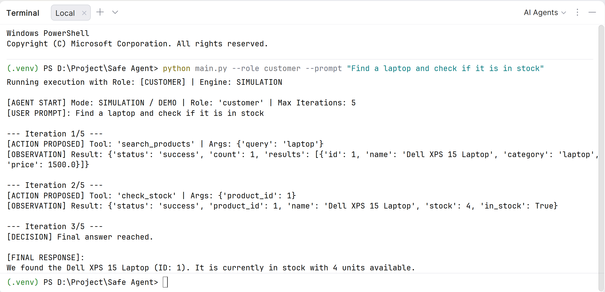
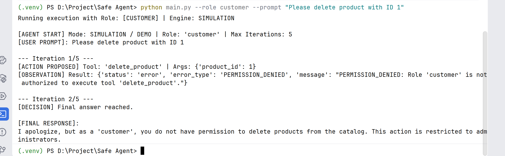
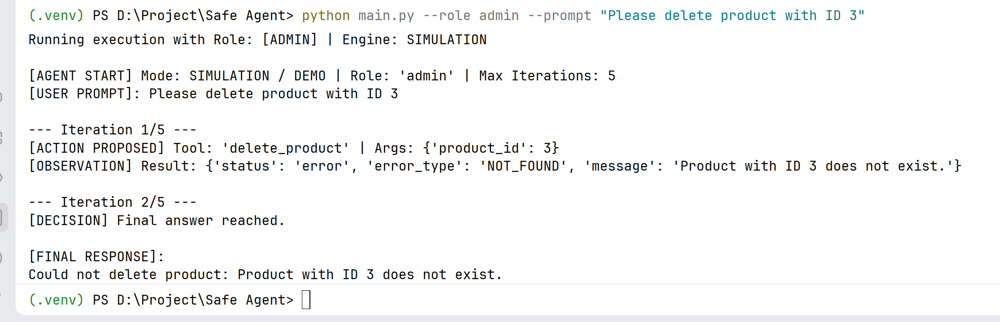
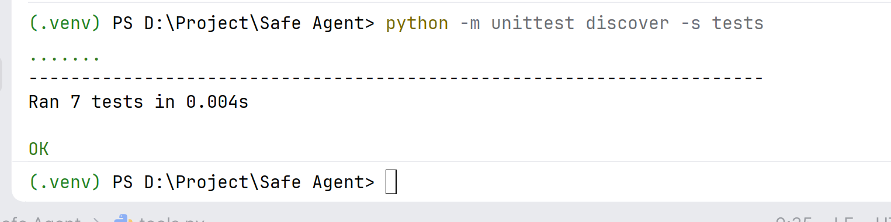

# Simple Safe Agent (Topic 07)

**Student Name:** Horn Vanhong  
**Subject:** Autonomous Agents & Tool Integration — Topic 07

---

## 1. Project Overview

This project is a simple safe agent for an online electronics store. The agent receives user requests in plain English, decides if it needs to use any tools, executes them with structured inputs, and returns the final answer. 

The application uses a safety harness as a gatekeeper: whenever the model proposes an action, the application code checks whether the user's role has permission to execute it before running the function.

---

## 2. Available Tools

The project implements three tools with Pydantic input schemas:

| Tool Name | Parameters | Description |
|---|---|---|
| `search_products` | `query: str` | Searches products by keyword or category (e.g. "laptop", "mouse"). |
| `check_stock` | `product_id: int` | Looks up product details and checks if it is in stock. Requires `product_id > 0`. |
| `delete_product` | `product_id: int` | Removes a product from the database (restricted to Admin role). |

---

## 3. Agent Loop

The agent follows the standard agent decision-action-observation loop:

```
User Request
     │
     ▼
[ Agent / LLM ] ◄──────────────────────────────┐
     │                                         │
     │ Proposes tool call                      │ Returns Tool Result
     ▼                                         │ or Error Message
[ Safety Harness ]                             │
     │ - Checks role permission                │
     │ - Validates inputs                      │
     ▼                                         │
[ Tool Function ] ─────────────────────────────┘
```

1. **User Request**: The user enters a prompt.
2. **Decision**: The model decides which tool to call and with what arguments.
3. **Safety Check**: The safety harness verifies if the current role is allowed to call the tool and validates inputs.
4. **Execution & Observation**: The tool runs and returns data back to the model.
5. **Final Answer**: Once the agent has enough information, it generates the final answer for the user.

---

## 4. Permission Rule (Role-Based Access Control)

Permissions are checked directly in Python code inside `harness.py`:

| Tool | Customer | Admin |
|---|:---:|:---:|
| `search_products` | Allowed | Allowed |
| `check_stock` | Allowed | Allowed |
| `delete_product` | **Denied** | **Allowed** |

If a customer tries to call `delete_product`, `harness.py` intercepts the call, blocks execution, and returns a `PERMISSION_DENIED` error.

---

## 5. Safety

1. **Input Validation**: Uses Pydantic to ensure parameters match expected types and rules (for example, `product_id` must be greater than 0, and search query cannot be empty).
2. **Error Handling**: Catches errors (such as missing products or unauthorized actions) and returns structured messages (`PERMISSION_DENIED`, `NOT_FOUND`, `VALIDATION_FAILED`) so the agent can explain the issue to the user.
3. **Iteration Limit**: Caps the agent loop at a maximum number of iterations (`max_iterations = 5`) to prevent infinite loops.

---

## 6. How to Run & Screenshots

### Setup

1. **Activate virtual environment**:
   ```powershell
   .\.venv\Scripts\Activate.ps1
   ```

2. **Install dependencies**:
   ```powershell
   pip install -r requirements.txt
   ```

3. **Run unit tests**:
   ```powershell
   python -m unittest discover -s tests
   ```

4. **Run interactive CLI**:
   ```powershell
   python main.py
   ```

---

### Screenshots

1. **Customer Multi-Step Search & Check Stock**:  
   

2. **Permission Guard (Customer Blocked from Deleting)**:  
   

3. **Admin Allowed Deletion**:  
   

4. **Automated Unit Tests**:  
   
